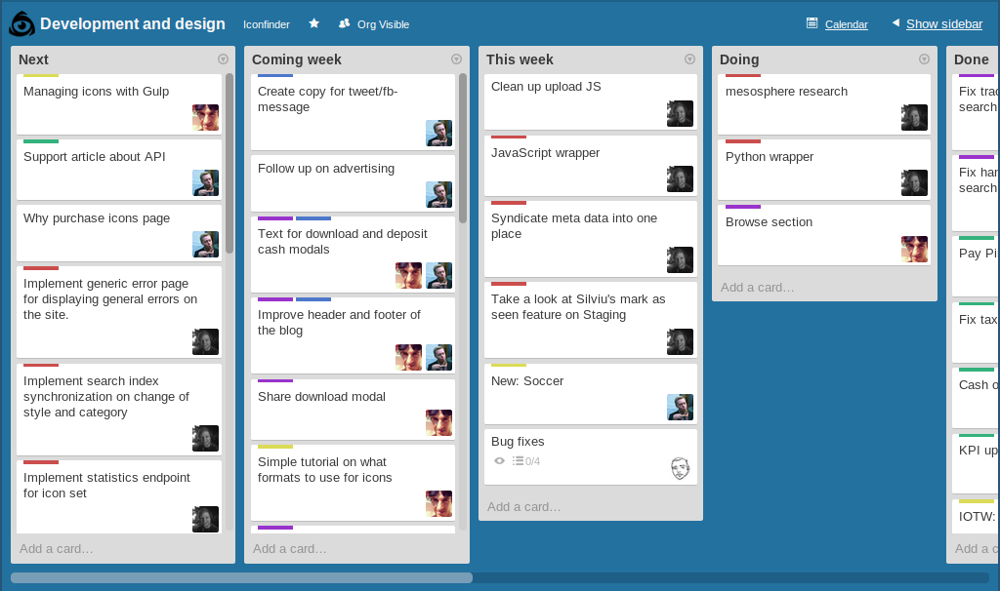

.. image:: img/iconfinder-logo-full.png

.. class:: text-center

**Simply the largest collection of premium icons in the world.**

----

About
#####

.. class:: text-center

Working from the lovely city of Copenhagen, Denmark, we are building the world's most popular icon site. A small team fueled by large amounts of caffeinated beverages.

.. image:: img/iconfinder-team.png

----

Iconfinder in numbers
#####################

Site usage
----------

.. class:: infograf span4

    Visitors/month
        3M

.. class:: infograf span4

    Requests/day
        3M

.. class:: infograf span4

    Total downloads
        156M

The geeky stats
---------------

.. class:: infograf span4

    Servers
        15

.. class:: infograf span4

    Lines of code
        100K

.. class:: infograf span4

    Coffee consumed
        156L

----

Build on Open Source
####################

Main codebase:
    .. figure:: img/logos/django.png
        :width: 30%
        :align: left

Database:
    .. figure:: img/logos/postgresql.png
        :width: 30%
        :align: left

Revision control:
    .. figure:: img/logos/git.png
        :width: 20%
        :align: left

Configuration management:
    .. figure:: img/logos/puppet.png
        :width: 30%
        :align: left

----

DevOps culture
##############

----

Workflow
########

----

Workflow
########

----

Workflow
########

----

Workflow
########

----

Workflow
########

----

Workflow
########

----

Workflow
########

----

Vagrant Box
###########

----

Other tasks
###########

* Notification framework that pushes in real time events from the
  back-end to the clients browser.
* Custom tailored comment system.
* Automated system that pushes out recommendation emails to users
  based on what they bought in the past.
* PayPal integration for cashing out.
* CSS responsive layout optimization for mobile.
* Took active participation in finding and squashing a large amount of bugs.
