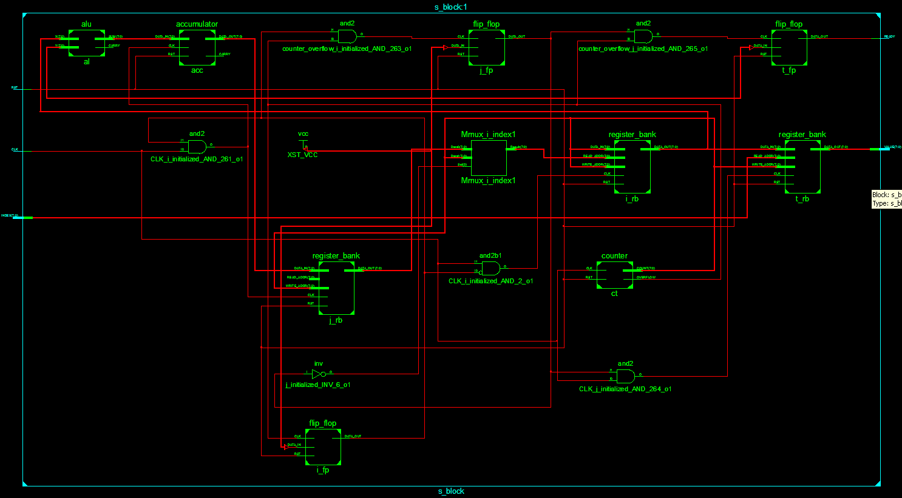

RC4: A hardware implementation
==============================

----

Short introduction
==================

* Widely used, integrated into TLS/SSL, WEP, Remote Desktop Protocol, SSH, BitTorrent and Skype ammong others.

* Consists of two stages, **KSA** and **PRGA**.

----

Schematics
==========

.. figure:: img/rc4-chip-schematics.png
    :align: center
    :width: 60%

----

KSA
===

Key-scheduling algorithm
------------------------

.. code-block:: python

    for i from 0 to 255
        S[i] := i
    endfor
    j := 0
    for i from 0 to 255
        j := (j + S[i] + key[i mod keylength]) mod 256
        swap values of S[i] and S[j]
    endfor

----

KSA: VHDL implementation
========================

----

KSA: VHDL implementation
========================

.. figure:: img/register-banks.png
    :align: center
    :width: 55%

----

PRGA
====

Pseudo-random generation algorithm
----------------------------------

.. code-block:: python

    i := 0
    j := 0
    while GeneratingOutput:
        i := (i + 1) mod 256
        j := (j + S[i]) mod 256
        swap values of S[i] and S[j]
        K := S[(S[i] + S[j]) mod 256]
        output K
    endwhile

----

PRGA: VHDL implementation
=========================

.
