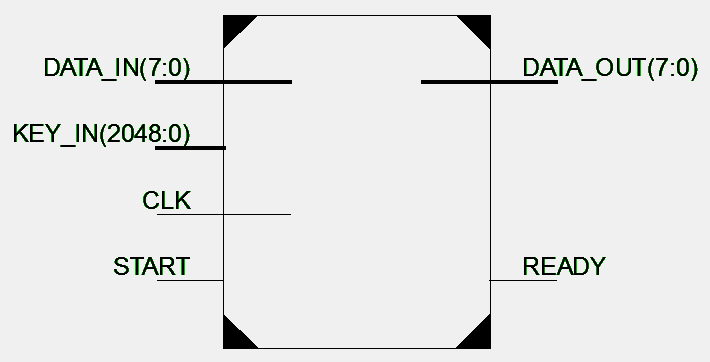
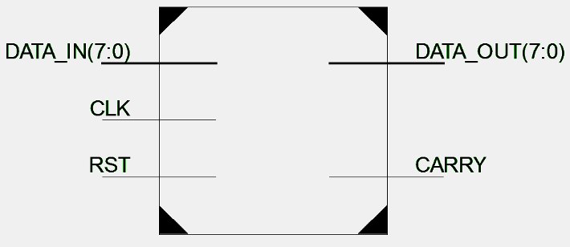
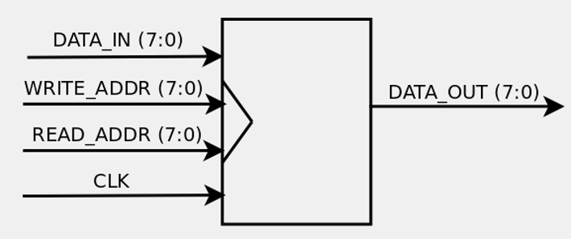

RC4: A hardware implementation
==============================

----

Short introduction
==================

Widely used, integrated into TLS/SSL, WEP, Remote Desktop Protocol, SSH, BitTorrent and Skype ammong others.

Consists of two stages:

KSA:
    Key-scheduling algorithm
PRGA:
    Pseudo-random generation algorithm

----

Schematics overview
===================

----

Accumulator
===========

----

Flip-flop
=========

----

Register bank
=============

----

KSA Phase
=========

.. code-block:: python

    for i from 0 to 255
        S[i] := i
    endfor
    j := 0
    for i from 0 to 255
        j := (j + S[i] + key[i mod keylength]) mod 256
        swap values of S[i] and S[j]
    endfor

